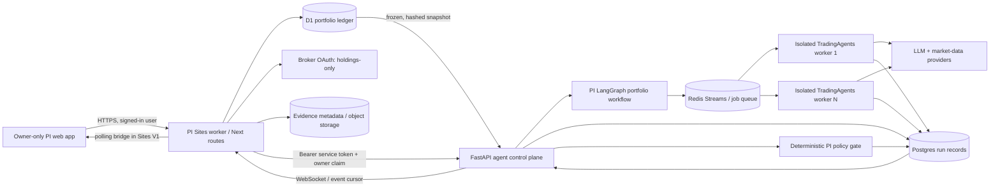

# Portfolio Intelligence × TradingAgents: V1 technical specification

Status: deployable test UI plus an independently deployable LangGraph research runtime.
Source baseline: `TauricResearch/TradingAgents` commit
`a33fd4c0f134485a43553a2c23a63cb14adbd88f` (v0.3.1-era main).

## 1. Decision summary

Portfolio Intelligence (PI) remains the source of truth for identity, portfolio
snapshots, transactions, broker connections, evidence, and user policy.
TradingAgents is an advisory computation engine behind a private server-to-server
boundary. It can read a frozen snapshot and return research artifacts; it cannot
write the ledger, alter policy, or place a brokerage order.

This boundary is required because TradingAgents is designed around a ticker/date
`propagate()` call, model/provider credentials, filesystem checkpoints, and a
process-global configuration setter. It is not a multi-tenant portfolio database
or an execution system.

## 2. Upstream model and compatibility contract

The upstream graph is instantiated through
[`TradingAgentsGraph`](https://github.com/TauricResearch/TradingAgents/blob/main/tradingagents/graph/trading_graph.py)
and called with a ticker, date, and asset type. Its
[`AgentState`](https://github.com/TauricResearch/TradingAgents/blob/main/tradingagents/agents/utils/agent_states.py)
carries four analyst reports, bull/bear debate state, an investment plan, a trader
proposal, three-way risk debate state, and a final portfolio decision. Upstream
[`structured schemas`](https://github.com/TauricResearch/TradingAgents/blob/main/tradingagents/agents/schemas.py)
provide ratings and trader/portfolio summaries, while several intermediate fields
remain rendered text.

PI integrates at those public seams and does not fork or edit upstream internals:

1. `TradingAgentsGraph(selected_analysts, config, callbacks)` creates a run.
2. `propagate(analysis_symbol, analysis_date, asset_type="stock")` executes one
   holding.
3. Sanitized callbacks emit lifecycle telemetry without prompt contents or hidden
   model reasoning.
4. The adapter normalizes the final state and decision into a stable PI result.
5. A separate deterministic policy engine can block a model-generated proposal.

Indian instruments use confirmed market-data identifiers: NSE `SYMBOL.NS`, BSE
`SYMBOL.BO`. A symbol without a confirmed exchange mapping blocks the run rather
than guessing.

## 3. Target architecture



Diagram description: the browser never contacts TradingAgents or receives its API
token. The PI server reads an owner-scoped portfolio, hashes and freezes it, then
submits the snapshot to a FastAPI control plane. A production control plane fans
symbol jobs out through a queue to isolated single-concurrency workers. Results
and sanitized events return through durable run storage. PI displays them beside
independent policy outcomes. Brokerage OAuth is a separate holdings-only path and
has no connection to agent execution.

### Deployment units

| Unit | V1 implementation | Production target |
|---|---|---|
| PI web/dashboard | Next.js/React on Sites, Cloudflare D1 | Same, plus object storage for uploads |
| Agent API | Python 3.12, FastAPI, Pydantic | Autoscaled private service |
| Agent workers | PI LangGraph workflow + TradingAgents graph, global mutex | One graph per worker process/container |
| Run store/events | In-memory test store, event cursor, WebSocket | Postgres + Redis Streams |
| Portfolio updates | Manual/CSV and Upstox read-only OAuth | Additional read-only broker connectors |
| UI transport | Two-second event polling through PI | SSE or WebSocket relay at scale |

The in-memory runtime is appropriate only for an owner-only test: a restart loses
run history, and a single worker serializes symbols. Production activation is
blocked until Postgres/Redis and process-isolated workers replace it.

## 4. Domain ownership and data contracts

### Canonical PI data

- `portfolios`: owner, name, currency, demo flag.
- `transactions`: append-only buy/sell/reversal events with idempotency keys.
- `portfolio_prices`: time-stamped, source-labelled manual observations.
- `account_holdings`: latest encrypted-connector snapshot.
- `instrument_mappings`: exchange and confirmed TradingAgents market symbol.
- `evidence_items`: source URI, tier, dates, hash, verification status.
- `agent_policy`: represented by the V1 policy contract; persist/edit per owner in
  the next database migration.

TradingAgents never becomes authoritative for quantity, cost basis, allocation,
available cash, or policy.

### XLS ingestion contract

A representative consolidated workbook demonstrates why ingestion requires
staging. One sheet may mix tax-lot rows with allocation-only separators and
summary rows. Instrument identity can embed exchange and quote timestamps;
quantities may contain thousands separators; and one instrument may appear on
multiple acquisition dates.

The V1 normalizer and import ledger use these stages:

1. Parse locally into a normalized `pi-portfolio-import/v1` document; do not write holdings yet.
2. Classify lot, allocation-only, total, blank, and invalid rows.
3. Normalize stock name, exchange, quote timestamp, quantity, cost, and price.
4. Aggregate lots by confirmed `(exchange, symbol)` while preserving each lot.
5. Reconcile investment amount, market value, total quantity, and allocation sum.
6. Present the normalized rows for owner review; conflicting source files remain blocked.
7. Commit one immutable import event plus normalized lot/holding records after confirmation.

PDFs are evidence candidates only. Their text is untrusted content, cannot set
policy, and cannot mutate holdings.

### Run request

`POST /v1/runs` accepts:

- owner-scoped `portfolio_id`;
- immutable `snapshot_id`, SHA-256 `snapshot_hash`, and `as_of`;
- normalized holdings with confirmed `analysis_symbol`;
- selected analysts/symbols and `review` or `weekly_trigger` mode;
- reserve, deployable cash, position/deployment caps, freshness, no-equal-weighting,
  and mandatory-human-confirmation rules.

The runtime returns `queued`, `running`, `completed`, `blocked`, or `failed`, plus
run-level checks and normalized symbol results.

### Events and telemetry

`GET /v1/runs/{id}/events?after=N` and `WS /v1/ws/runs/{id}` expose ordered events:

```json
{
  "sequence": 12,
  "occurred_at": "2026-08-26T10:00:00Z",
  "level": "info",
  "stage": "tool",
  "symbol": "EXMPL",
  "message": "Market data lookup completed"
}
```

Events report stage, status, duration-ready timestamps, symbol, and sanitized error
class. They exclude prompts, tool inputs, raw model outputs, credentials, and hidden
reasoning.

## 5. Orchestration and interaction design

### LangGraph requirement

LangGraph is the required orchestration engine for PI agent workflows. The V1
portfolio graph is versioned as `pi-portfolio-v1` and routes:

`select_symbol → tradingagents_analysis → pi_policy_review → next_symbol/end`

Future ingestion agents, review agents, scheduled triggers, contradiction checks,
and approval flows must be implemented as versioned nodes or subgraphs. Pure
financial arithmetic, portfolio reconciliation, authentication, ledger writes,
and hard risk limits remain deterministic services called at graph boundaries;
they must not be delegated to an LLM node.

### Ingestion mode

The setup screen supports manual holdings, browser-parsed canonical CSV, reviewed
normalized JSON, and read-only Upstox OAuth. A deterministic Python normalizer
converts the supplied legacy XLS export, preserves 89 source tax lots, reconciles
totals, and refuses unmapped instruments. Broker passwords are never collected;
access tokens are encrypted at rest and remain server-side.

### Review mode

The copilot reads deterministic portfolio metrics and verified evidence. Once a run
completes, “Agent run” mode reads only that run's normalized artifacts. Answers cite
symbols and timestamps and label execution requests as restricted.

### Trigger mode

“Run weekly check” performs preflight checks, freezes the portfolio, and starts the
selected universe. The dashboard renders an ordered activity log and a compact
decision table: portfolio rating, trader proposal, model summary, and independent
policy status. It avoids unauditable stock-by-stock narrative dumps.

### Portfolio-aware policy layer

Upstream debate is ticker-centric. PI adds portfolio context after each symbol:

- reserve floor and deployable-cash boundary;
- current position cap;
- maximum single deployment;
- price freshness and allocation reconciliation;
- confirmed instrument mapping;
- no equal-weight allocation rule;
- mandatory explicit human confirmation.

Any future order ticket is a separate approval workflow. V1 contains no order API.

## 6. Security, reliability, and observability

- Owner-only Sites access is the first deployment boundary.
- PI signs runtime calls with a long random bearer token and an owner claim derived
  from authenticated server headers; neither reaches browser JavaScript.
- Broker tokens use AES-GCM and are never shared with TradingAgents.
- Every run binds to a portfolio hash, analysis date, upstream commit, model/provider
  configuration fingerprint, and ordered event log.
- Provider timeouts, retry budgets, and circuit breakers apply per tool; failures
  remain visible rather than silently falling back to fabricated data.
- Model and market-data cost is budgeted per run and per owner before fan-out.
- Raw third-party content is treated as data and never as executable instructions.
- Logs redact tokens, prompts, portfolio quantities, and tool payloads by default.

Service-level objectives after durable infrastructure:

- API acceptance p95 under 500 ms;
- first telemetry event p95 under 2 seconds;
- event delivery lag p95 under 3 seconds;
- no duplicated symbol job for one idempotency key;
- 100% run-to-snapshot and result-to-policy audit linkage.

## 7. Meta-reflection: analyze, critique, refine

### Analyze

The initial design mapped each upstream role directly to a dashboard panel and
proposed concurrent analyst execution. Checking the core graph invalidated that
assumption: upstream currently sequences analyst nodes and exposes one
`propagate(ticker, date)` boundary. It also installs configuration globally. The
direct mapping would have implied concurrency and portfolio awareness that the
repository does not currently provide.

### Critique

The naive architecture had four bottlenecks and gaps:

1. A full portfolio multiplied by four analysts and two debates creates high latency,
   provider rate pressure, and unpredictable cost.
2. Concurrent graphs with different configurations in one process can leak global
   settings.
3. Rendered intermediate text is not a stable UI contract, and exposing it as
   “reasoning” would confuse narration with auditable evidence.
4. A ticker-level portfolio-manager label can contradict portfolio constraints such
   as concentration, protected reserve, or fresh-data requirements.

### Refine

The refined design pins upstream, isolates worker processes, uses bounded portfolio
fan-out, and normalizes only public final artifacts. A cheap deterministic preflight
blocks stale/unmapped/unreconciled input before model spend. PI applies a second,
independent policy gate after the model. The UI streams sanitized lifecycle events,
not chain-of-thought, and clearly distinguishes “model rating,” “trader proposal,”
and “PI policy status.” Run history becomes durable before multi-user launch.

## 8. Phased roadmap and acceptance gates

### Phase 0 — completed foundation

- Owner-only PI deployment.
- Manual/CSV setup and read-only Upstox connector contract.
- Append-only transaction ledger, source-labelled prices, deterministic dashboard.
- TradingAgents source analysis and pinned compatibility baseline.

### Phase 1 — V1 test build (this change)

- FastAPI/Pydantic wrapper, PI LangGraph workflow, and Docker image.
- Authentication, frozen snapshot, deterministic pre/post policy checks.
- Status, run, event, WebSocket, and grounded run-chat APIs.
- Agent desk with readiness, symbol selection, live activity, results, and policy.
- Server-only Sites bridge and explicit unconfigured/offline states.
- Demo-data purge, source-hashed import ledger, tax-lot persistence, XLS normalizer,
  and metadata-only PDF intake.

Gate: build/tests pass; runtime cannot execute trades; UI does not fake an online
runtime; missing/stale mappings block analysis.

### Phase 2 — controlled owner pilot

- Deploy runtime with provider secrets and private ingress.
- Add Postgres run/evidence store and Redis Streams queue.
- Run one graph per process with idempotent symbol jobs, cancellation, timeouts, and
  cost/rate budgets.
- Add private object storage, server-side upload processing, multi-file conflict
  reconciliation, and snapshot diff.
- Persist editable owner policy and weekly schedule.

Gate: restart-safe run history, reconciliation tests on supplied workbook, provider
failure drills, and three successful owner-reviewed weekly runs.

### Phase 3 — evidence and review quality

- Attach filings/news/tool-source metadata to each analyst claim.
- Add freshness/contradiction scoring and diffable weekly decision tables.
- Evaluate chat grounding, policy adherence, and rating stability against a fixed
  historical test corpus.
- Add notifications for completed/blocked runs, not trade prompts.

Gate: citation coverage target met, no uncited portfolio recommendation, measured
false-grounding rate below the agreed threshold.

### Phase 4 — limited multi-user beta

- Tenant-isolated secrets, quotas, audit export, deletion/retention controls.
- Horizontal worker autoscaling and connector expansion.
- Accessibility audit (WCAG 2.2 AA), load test, incident runbooks, and cost controls.

Gate: security review, tenant-isolation tests, SLOs, backup/restore exercise, and
explicit legal/compliance approval. Brokerage execution remains out of scope until
a separately reviewed approval architecture exists.
