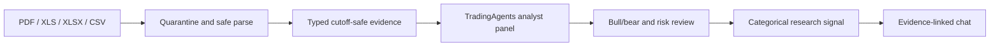

# TradingAgents file-to-chat demo

Status: local MVP candidate; not production-approved and not accuracy-qualified for real-money use.

## Demo outcome

The MVP now demonstrates one bounded path:

Ledger files and research files have deliberately different authority:

| Input | Demo behavior | What it cannot do |
|---|---|---|
| Certified `spi-ledger-csv/v1` | Existing reconciliation workbench and explicit publication | Bypass owner review or mutate an existing ledger silently |
| Research CSV/XLS/XLSX | Normalize supported market/portfolio columns into reviewed evidence | Become portfolio truth |
| Economic Times stock PDF | Extract price, return, score, outlook, PE, and PB claims when present | Execute page scripts or treat publisher language as an instruction |
| Watchlist X-ray PDF | Extract instrument-scoped current-price and return claims | Infer missing cells or exceed the evidence-claim cap |
| Supported Julius Baer contract-note PDF | Extract trade-side, quantity, and rate claims as evidence | Publish those trades into holdings automatically |

Every prediction is one of `BULLISH`, `BEARISH`, `NEUTRAL`, or `ABSTAIN`. It is produced after the
market/fundamental/news/sentiment analysts, bull/bear comparison, and aggressive/neutral/
conservative risk perspectives adapted from
`TauricResearch/TradingAgents@a33fd4c0f134485a43553a2c23a63cb14adbd88f`. The signal is a
research classification, not an order, price target, or promised return.

## Fast local showcase

1. Generate local secrets and start the stack:

       python scripts/bootstrap_env.py
       docker compose up --build

2. Open `http://localhost:3000` and create a portfolio.
3. Under **Add a data source**, use **Add research evidence for the demo** to upload the supplied
   watchlist PDF, one Economic Times stock PDF, or `Qber-Aug2026.xls`.
4. Under **Ask Portfolio Intelligence**, type the matching security focus. Examples:
   `YATHARTH.NS`, `AXISCADES.NS`, `ADANIPORTS.NS`, or a company name from the workbook.
5. Ask: `What is the TradingAgents research signal and which evidence supports it?`
6. Verify the response shows the signal, confidence, evidence count, run ID, citations, proposal-only
   status, and disabled execution capability.

For the cleanest two-sided demo, load Yatharth Hospital evidence to show a bullish classification
and AXISCADES evidence to show a bearish or mixed classification. The exact result depends on all
cutoff-eligible files loaded into that portfolio. Uploading only a contract note should abstain
because an execution record is not directional research.

Live language synthesis is optional. Set `OPENAI_API_KEY` and `OPENAI_MODEL` for model-written
summaries. Without them, the same graph, evidence scoping, debate/risk stages, signal adapter,
policy gate, and citation validator run in deterministic safe mode.

## Validation performed with the supplied files

| Supplied source | Parser | Result |
|---|---|---|
| Julius Baer contract note PDF | `spi-julius-baer-contract-note-pdf` | 30 claims across 5 instruments |
| Qber August 2026 XLS | `spi-holdings-workbook` | 90 claims across 18 instruments |
| Watchlist X-ray PDF | `spi-watchlist-xray-pdf` | 84 claims across 14 instruments |
| Ten Economic Times stock PDFs | `spi-economic-times-pdf` | 9-12 claims per stock |

Automated verification covers safe file handling, Economic Times extraction, watchlist row parsing,
contract-note extraction, XLS aggregation, automatic evidence registration, tenant-scoped agent
context, instrument matching, bullish classification, abstention, non-execution validation, numeric
citation enforcement, TypeScript, and the optimized web build.

## Self-critique and immediate workarounds

### Speed versus core integration

The MVP prioritizes the actual TradingAgents decision shape rather than installing the upstream
repository as a runtime package. This avoids its broad live-data dependency graph and keeps uploaded
evidence inside Portfolio Intelligence's tenant, cutoff, and policy boundary. The tradeoff is that
this is a pinned, reviewable adapter, not an unmodified call to `TradingAgentsGraph.propagate()`.

Immediate demo workaround: show the upstream repository and commit in the response telemetry and
use the documented analyst/debate/risk stages. Do not claim that the upstream CLI itself is running.

### Ingestion robustness

The supplied native-text PDFs and legacy XLS workbook are covered. Scanned PDFs still require OCR,
unknown broker layouts remain `unsupported_layout`, formulas are never executed, and extraction is
bounded to 100 claims per document.

Immediate demo workaround: use the supplied validated files. If a new layout reports zero claims,
show the honest manual-mapping state instead of switching to unconstrained LLM extraction.

### Prediction accuracy

A single point-in-time document cannot establish predictive accuracy. The MVP validates structural
correctness, source traceability, cutoff safety, confidence calibration, and deterministic response
behavior; it does not prove out-of-sample returns.

Immediate demo workaround: describe outputs as research signals and demonstrate abstention. The
next accuracy milestone is a frozen historical corpus with known-at timestamps, benchmarked holding
periods, leakage tests, and signal precision/return/drawdown reporting.

### Runtime bottlenecks

- Large PDFs are parsed synchronously in local demo mode; move extraction to the existing queued
  ingestion design before concurrent use.
- The hosted web application still needs separately deployed Core and Agent services plus matching
  internal credentials.
- Live synthesis needs one configured LLM key and may add latency or rate-limit failures.
- Production direct upload remains gate-controlled and must not be enabled before malware, identity,
  RLS, and telemetry evidence is signed.

For a short showcase, run the local Docker stack, preload two or three supplied sources, keep live
synthesis optional, and prepare one bullish, one bearish/mixed, and one abstention question.
